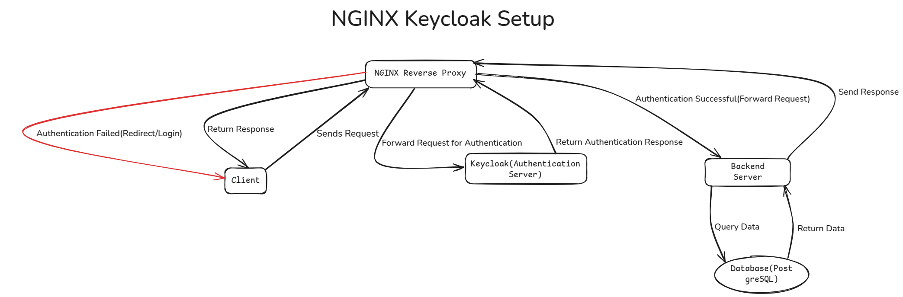

# Approach Paper - Nginx Reverse Proxy with Keycloak Authentication

## 1. Objective

The objective of this project is to set up Nginx as a reverse proxy and integrate it with Keycloak for authentication.

- A user request is sent to Nginx (Reverse Proxy).
- Nginx forwards the request to Keycloak for authentication.
- If authentication is successful, Nginx forwards the request to the backend.
- If authentication fails, Nginx returns an error or redirects the user to the login page.

## 2. Proposed Solution

### Approach: Nginx Reverse Proxy with Keycloak Authentication (Based on Test Cases)

- This approach is set up by the Nginx reverse proxy with Keycloak authentication.
- Users authenticate through Keycloak before being allowed to access the backend.

## 3. Approach: Nginx Reverse Proxy with Keycloak Authentication

### 3.1 Architecture Diagram

### 3.2 Description

- Nginx acts as a reverse proxy and routes requests to Keycloak for authentication.
- If authentication is successful, Nginx forwards the request to the backend.
- Unauthenticated users are redirected to the Keycloak login page.

#### Pros:
- Simple and follows a widely used authentication mechanism.
- Easily integrates with existing infrastructure.
- Supports multiple authentication methods (OIDC, SAML, LDAP, etc.).

#### Cons:
- Single point of failure if Nginx is not highly available.
- Increased complexity in managing Nginx and Keycloak configurations.

### 3.3 Pre-requisites

#### 3.3.1 Hardware Requirements
- Any standard server with at least 2 vCPUs, 4GB RAM, and 20GB storage.

#### 3.3.2 Software Requirements
- Ubuntu Linux (Latest Version)
- Podman (Latest Version)
- Nginx
- Keycloak
- Backend Application (Node.js, Python, etc.)

#### 3.3.3 Networking Requirements
- Open ports: 80 (HTTP), 443 (HTTPS), 8080 (Keycloak), 9000 (Backend)
- Internet access for package installations
